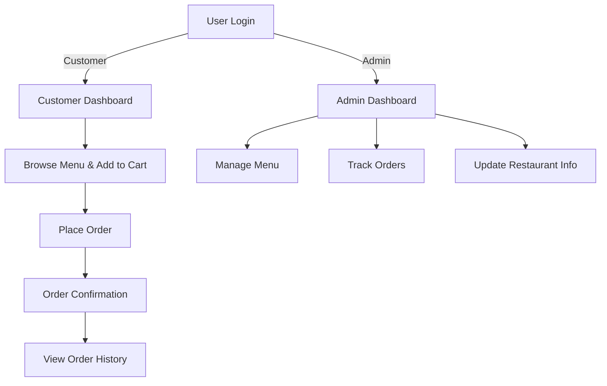

# 🍽️ Food on Track - Online Food Ordering System

## 🌍 Overview

**Food on Track** is a **PHP-based online food ordering system** that enables customers to browse restaurant menus, add food items to their cart, and place orders seamlessly. The platform provides an **Admin Panel** for managing menus, tracking customer orders, and updating restaurant details. The system ensures smooth order processing with **secure authentication, dynamic menu updates, and order tracking**.

---

## 👥 Users & Roles

### 🍔 **Customers**
- Register and log in securely.
- Browse available food menus and add items to their cart.
- Place and track orders.
- View order history.

### 🏪 **Admin**
- Manage restaurant menus (add, update, and remove food items).
- View and process customer orders.
- Track restaurant sales and customer activity.

---

## 📊 Workflow Diagram



---

## ⭐ Features

### 🔑 Secure Authentication
- **Role-based login** (Customers & Admins).
- Secure **session management** to prevent unauthorized access.

### 🍽️ Restaurant Menu Management
- Dynamic **menu updates** with images and pricing.
- Categories and **special offers management**.
- Admin dashboard for **easy menu handling**.

### 🛒 Online Ordering System
- Customers can browse menus and **add food items to their cart**.
- **Real-time order status updates**.
- View past orders and invoices.

### 📜 Order History & Management
- Customers can **view and track past orders**.
- Admins can **track and update order status**.

### 🎨 UI & Responsiveness
- Fully responsive design with **Bootstrap & jQuery**.
- **User-friendly navigation** for seamless food ordering.

---

## 📥 Installation Guide

### Step 1: Clone the Repository
```sh
git clone https://github.com/DarshanScripts/food-on-track.git
```

### Step 2: Set Up the Database
1. Open **phpMyAdmin** (or any MySQL database manager).
2. Create a new database (e.g., `food_on_track`).
3. Import the provided SQL schema from `Database/Schema.sql`.
4. Open `DBConnection.php` and update the database credentials:
```php
$servername = "localhost";
$username = "root";
$password = "";
$database = "food_on_track";
```

### Step 3: Run the Application
1. Move the project folder to `htdocs` (for XAMPP) or `www` (for WAMP/LAMP).
2. Start **Apache** and **MySQL** services.
3. Open a browser and go to:
   ```sh
   http://localhost/food-on-track/
   ```

---

## 📂 Project Structure

```
food-on-track/
│── README.md                        # Documentation
│── Admin/                            # Admin portal
│   ├── AdminLogin.php                # Admin login
│   ├── AdminLogout.php               # Admin logout
│   ├── AdminReg.php                   # Admin registration
│   ├── Dashboard.php                  # Admin dashboard
│   ├── EditMenu.php                    # Edit restaurant menu
│   ├── FetchCustomer.php               # Retrieve customer data
│   ├── InsertMenu.php                  # Add new food items
│
│── Customer/                          # Customer portal
│   ├── Cart.php                        # Shopping cart management
│   ├── CustLogin.php                    # Customer login
│   ├── CustLogout.php                   # Customer logout
│   ├── CustReg.php                      # Customer registration
│   ├── FetchItem.php                    # Retrieve menu items
│   ├── Homepage.php                     # Main customer interface
│   ├── ViewOrders.php                    # View past orders
│
│── Database/                           # Database configurations
│   ├── DBConnection.php                 # Handles MySQL connection
│   ├── Schema.sql                        # Database schema setup
│   ├── foodontrack.sql                    # Sample database data
│
│── assets/                              # Frontend assets
│   ├── jquery-3.2.1.min.js                # JavaScript library
│   ├── style.css                           # Main stylesheet
│   ├── bootstrap/                           # Bootstrap UI framework
│       ├── css/                             # Bootstrap CSS files
│       ├── js/                              # Bootstrap JS files
```

---

## 💻 Technologies Used
- **PHP & MySQL** – Backend logic and database handling.
- **HTML, CSS, JavaScript** – Frontend development.
- **Bootstrap & jQuery** – Enhances UI responsiveness.
- **AJAX** – For real-time order updates.
- **Session Management** – Secure login authentication.

---

## 👨‍💻 Author
Developed by **Darshan Shah**. Connect with me:

- **LinkedIn**: [Darshan Shah](https://www.linkedin.com/in/darshan-shah-tech/)
- **Facebook**: [DarshanScripts](https://www.facebook.com/DarshanScripts)
- **GitHub**: [DarshanScripts](https://github.com/DarshanScripts)
- **Quora**: [Darshan Shah](https://www.quora.com/profile/Darshan-Shah-1056)
- **Medium**: [DarshanScripts](https://medium.com/@DarshanScripts)
- **Fiverr**: [DarshanScripts](https://www.fiverr.com/darshanscripts)
